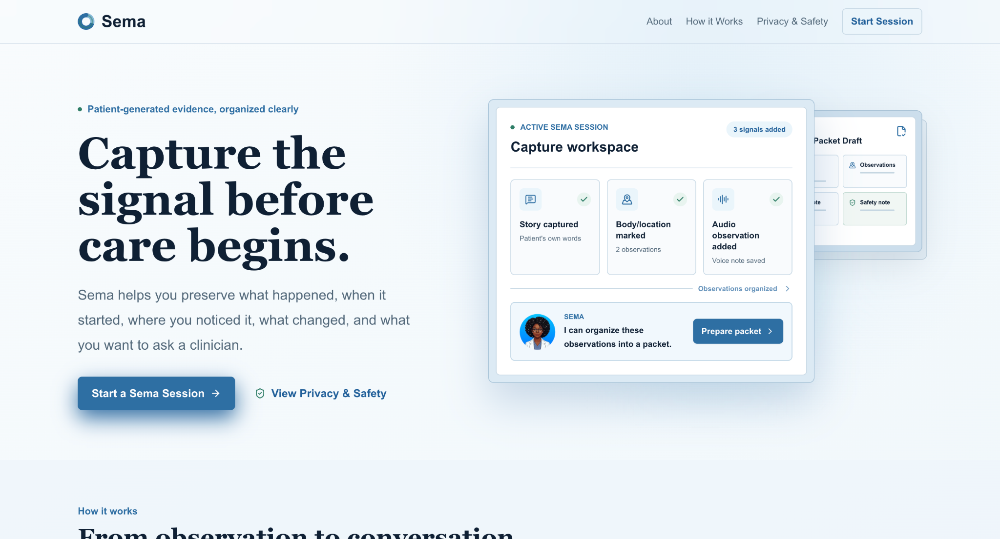
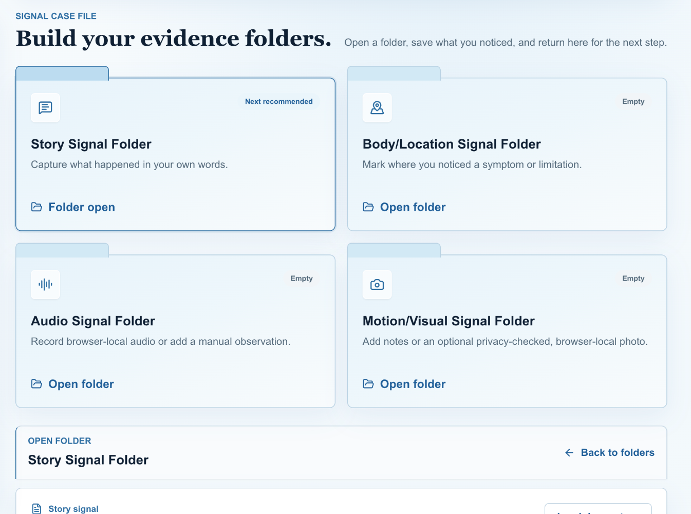
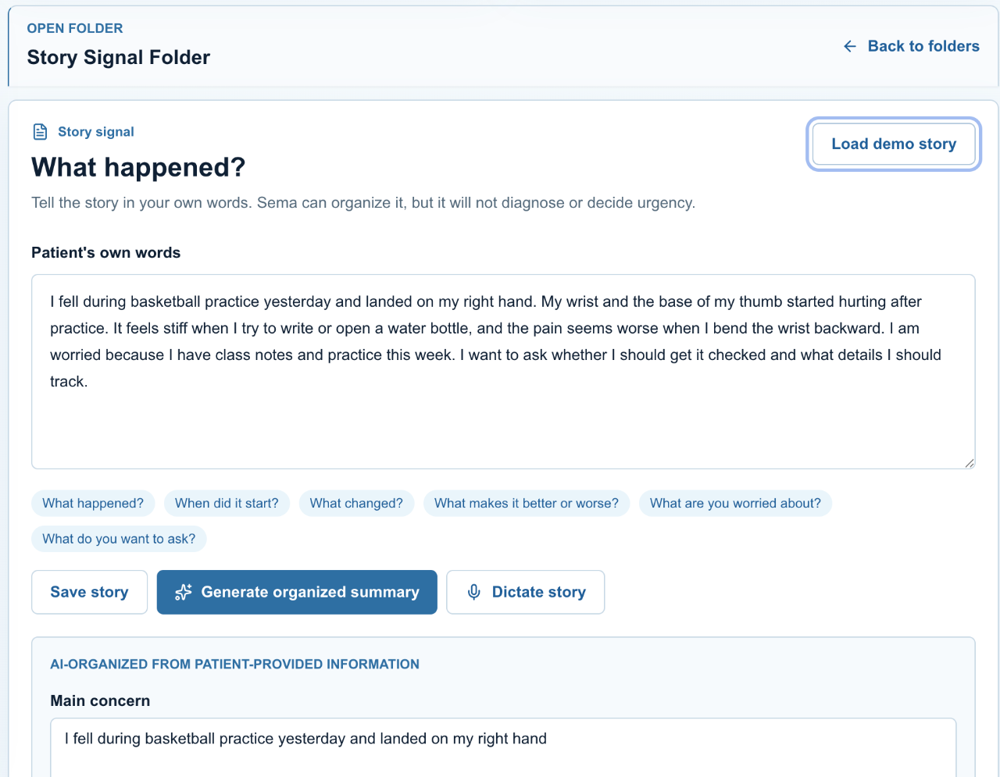
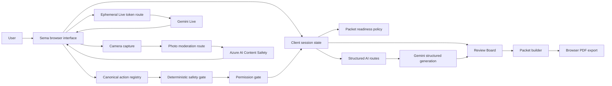
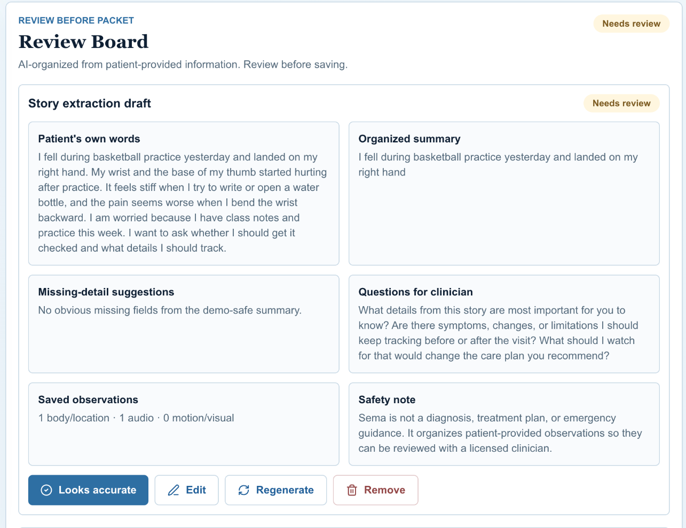
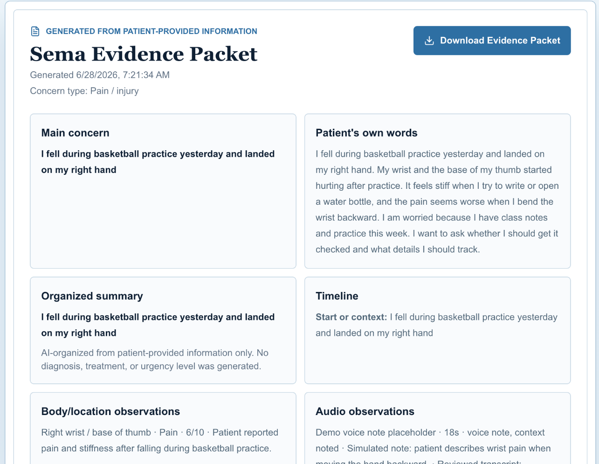
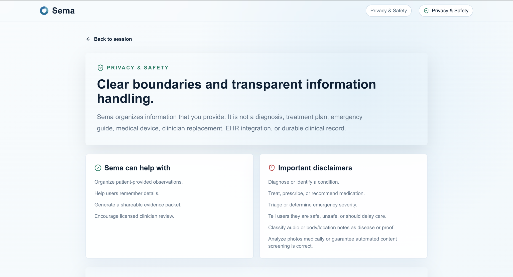
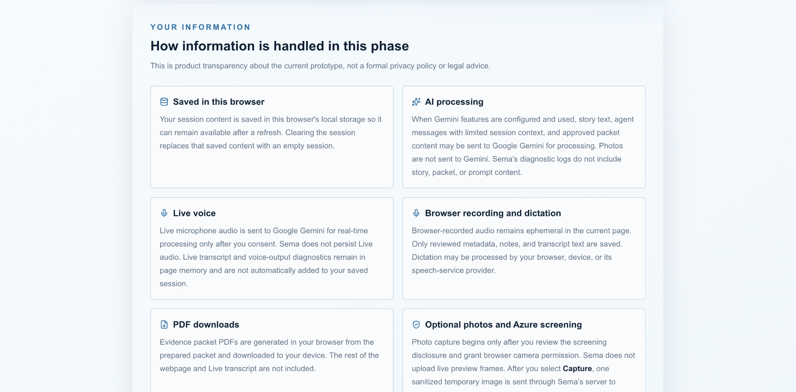
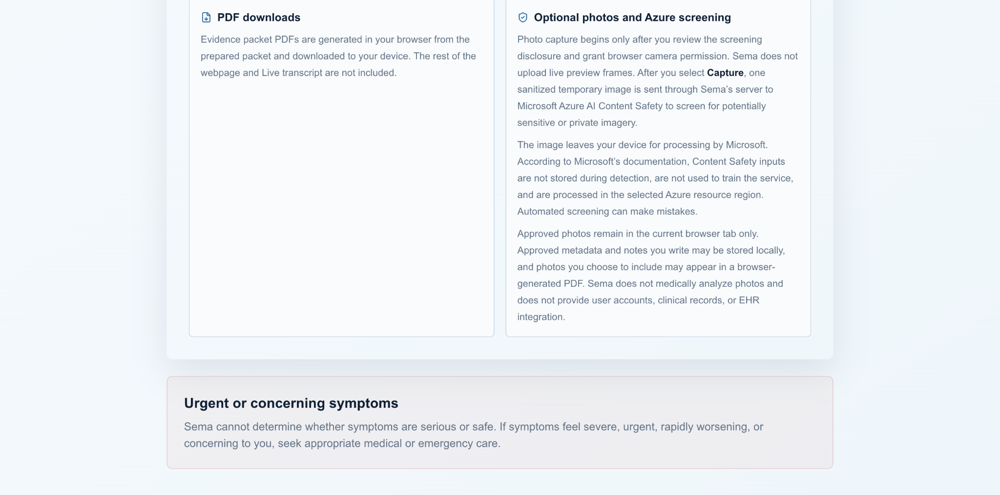

# Sema

Patient-generated evidence, organized for better clinical conversations.

Care starts before the appointment. Context usually does not.

Sema helps people capture and organize health observations into a reviewable, clinician-ready evidence packet. It is not an AI doctor, not a generic chatbot, and not a medical device. It is a structured evidence workflow for preserving what a person noticed before they speak with a licensed clinician.

Live demo: [https://sema-delta.vercel.app](https://sema-delta.vercel.app)

Production demo · Synthetic/demo-safe use only

<p align="center">
  
</p>

## At a glance

| Area | Details |
| --- | --- |
| Product | Multimodal patient-generated evidence organizer |
| Core artifact | Reviewable clinician-ready evidence packet |
| Interaction | Text, guided workspace, and page-aware Live voice |
| AI | Gemini structured generation and Gemini Live |
| Safety | Deterministic healthcare boundaries, canonical tools, permission gates, Review Board |
| Photo screening | Azure AI Content Safety for optional captured photos |
| Frontend | Next.js, React, TypeScript, Tailwind CSS |
| Deployment | Vercel Production demo |
| Verification | 555 automated checks plus real-browser Production QA |

The test count is an engineering verification signal, not a clinical-accuracy or model-safety claim.

## The problem

People often arrive at care with fragmented context: scattered memories, phone notes, recordings, images, uncertain timelines, and questions they meant to ask but forgot under pressure.

The problem is not that people lack experiences.

The problem is that those experiences are hard to preserve clearly.

Sema is built around the moments before the appointment: what happened, when it started, where it was felt, what changed, what was tried, and what the person wants to remember to ask. It does not decide what the information means medically. It helps keep the signal organized long enough for a better clinical conversation.

## The product idea

Voice is the interface. The packet is the product.

Sema organizes a session around evidence folders:

- Story
- Body/Location
- Audio
- Motion/Visual
- Review Board
- Evidence Packet

Each folder has a narrow job. Story captures the person’s own words. Body/Location records where something was noticed without interpreting it. Audio preserves reviewed metadata and optional transcript notes. Motion/Visual accepts notes and privacy-screened photos without medical analysis. The Review Board keeps generated content out of the packet until the user reviews it. The packet is the final, shareable artifact.

<p align="center">
  
</p>

## Core workflow

```text
Start a session
→ capture or resolve each evidence folder
→ review AI-organized content
→ prepare the packet
→ review the final artifact
→ export a browser-generated PDF
```

Sema keeps the flow deliberately structured. The workspace does not treat every model response as evidence. It separates capture, generation, review, approval, packet preparation, and export.

That separation is the product.

## What I engineered

I built Sema as a production-deployed healthcare-AI research and educational project demonstrating AI product engineering, real-time voice architecture, responsible AI boundaries, multimodal interaction, and deployment discipline.

The system includes:

- A responsive Next.js product shell with a premium blue-led visual language.
- Centralized client session state for evidence folders, review state, packet readiness, stale packet detection, and local persistence.
- Multimodal evidence capture across text, body/location notes, browser-local audio metadata, motion/visual notes, and optional photo capture.
- Gemini structured generation for story organization and packet drafting, with schema validation and deterministic fallback behavior.
- Gemini Live voice with page awareness, strict half-duplex audio, tool calling, permission gates, and typed fallback.
- Azure AI Content Safety screening for one sanitized optional photo after the user selects Capture.
- A canonical action registry that separates model proposals from app mutations.
- A Review Board where generated content starts as `needs_review` and must be approved before it enters the packet.
- Packet-readiness enforcement so unresolved evidence requirements block packet preparation.
- Browser-generated PDF export with non-diagnostic safety labeling.
- A privacy and safety surface that explains implemented data flows without claiming HIPAA compliance or clinical validation.

<p align="center">
  
</p>

## System design

Sema is designed as a set of boundaries rather than a single model prompt.



The browser owns the workspace, the current session, temporary media state, packet preview, and user-facing review flows. Server routes handle provider-backed work that needs server-side credentials. Third-party providers are treated as feature-specific processors, not clinical authorities.

## Live voice engineering

The hard part was not making the model speak. It was making the system know when to listen, when to wait, and when it was not allowed to act.

Sema Live uses a browser-first architecture:

- A user gesture initializes the output `AudioContext`.
- A same-origin server route mints a bounded ephemeral credential.
- The permanent Gemini key remains server-side.
- The browser connects directly to Gemini Live.
- Incoming server frames are normalized before parsing, including Blob and ArrayBuffer frames.
- Output PCM is decoded, queued, and scheduled through Web Audio.
- Microphone audio is inspected at runtime, resampled, encoded as 16 kHz PCM, and forwarded only while the visible state is Listening.
- Model output audio is played at 24 kHz PCM.
- Strict half-duplex prevents microphone forwarding while Sema is speaking, processing, in cooldown, waiting for permission, or running an action.
- Output turn IDs, connection generations, and cooldown generations prevent stale events from reopening the microphone.
- A duration-aware playback watchdog tracks progress without treating long scheduled audio as failure.
- Tool calls are validated through the canonical action registry.
- Duplicate tool calls are guarded by an in-memory idempotency ledger.
- Typed Sema remains available when voice ends or provider access is unavailable.

Current voice interaction is strict half-duplex. Sema does not support barge-in.

## Tool and permission architecture

Sema treats model output as a proposal, not authority.

Examples:

- “Open Story” → navigation action → no write permission required.
- “Add this to my Story” → write proposal → visible permission required → one approved mutation.
- “Prepare my packet” → readiness check → permission → packet generation.
- “Clear everything” → explicit high-impact confirmation.
- “Is this serious?” → deterministic safety block → no action.

Spoken agreement is not enough to approve a write. The visible permission UI is the boundary that turns a proposal into a mutation.

## Review Board and packet readiness

Generated content begins as `needs_review`.

The user can approve, edit, regenerate, or remove it. Unapproved generated content does not enter the packet. Story is required. Other folders need saved evidence or an explicit Not applicable resolution where allowed. Concern-relevant folders can require actual evidence. Unresolved requirements block packet preparation. If source evidence changes, the packet becomes stale and export remains blocked until regeneration.

<p align="center">
  
</p>

<p align="center">
  
</p>

## Safety by design

Sema is designed to preserve observations, not decide what is medically true.

Safety is enforced at multiple boundaries:

- before AI processing
- before action proposal
- before tool execution
- before packet generation
- before export

The system blocks diagnosis, treatment, medication, dosage, urgency classification, seriousness assessment, emergency decisioning, safe/unsafe claims, disease classification from audio, clinical interpretation of body-map notes, photo diagnosis, and invented facts.

The safety posture is intentionally conservative. False blocks are acceptable because the user can still preserve neutral observations and questions for a clinician.

## Privacy and trust boundaries

Sema’s public demo should use synthetic or demo-safe information only.

Browser-local or page-memory state includes:

- session evidence state
- temporary media state
- packet preview
- approved current-tab raw photo data
- pending permission proposals
- temporary Live transcript and voice diagnostics

Server routes handle:

- Gemini structured generation
- Gemini Live ephemeral credential minting
- packet narrative generation
- Azure image moderation

Third-party providers receive only the bounded information required for the selected feature. Gemini receives structured text/context for AI organization and Live voice. Azure receives one sanitized image after Capture for content-safety screening. Neither provider is presented as a clinical system.

<p align="center">
  
</p>

<p align="center">
  
</p>

## Optional photos and PDF boundaries

Photo capture is optional and starts only after disclosure and browser camera permission. Sema does not upload live preview frames. After Capture, the browser sanitizes one temporary image and sends it through Sema’s server to Microsoft Azure AI Content Safety to screen for potentially sensitive or private imagery.

Approved photos remain in the current browser tab only. Sema does not medically analyze photos. Packet PDFs are generated in the browser from the prepared packet and include safety labels.

<p align="center">
  
</p>

## Reliability engineering

Sema’s reliability model came from real integration work, not only static design.

Key safeguards include:

- Blob, string, ArrayBuffer, and ArrayBufferView frame normalization before protocol parsing.
- Serialized inbound message handling so one malformed frame does not poison the receive chain.
- Ordered PCM scheduling with interruption-safe generation boundaries.
- Runtime microphone sample-rate inspection and 16 kHz transmitted microphone PCM.
- 24 kHz output playback for Gemini Live audio.
- Strict microphone forwarding gates tied to the authoritative presentation state.
- Output-turn IDs, user-turn IDs, cooldown generations, and connection generations to reject stale events.
- Duration-aware playback deadlines and source-end progress tracking.
- Explicit microphone chunk accounting across raw frames, resampler input, encoded chunks, forwarded chunks, discarded classes, failures, and pending buffers.
- Tool-call idempotency scoped to the Live session.
- Packet staleness checks when source evidence changes.
- Deterministic local fallbacks for structured AI features.
- Graceful voice ending with typed interaction still available.

## Technology stack

Frontend:

- Next.js
- React
- TypeScript
- Tailwind CSS

AI and providers:

- Gemini structured generation
- Gemini Live
- Azure AI Content Safety

Browser systems:

- Web Audio API
- MediaDevices
- MediaRecorder for browser-local recording flows
- client-side PDF generation
- local browser persistence

Deployment:

- Vercel

## Testing and verification

Automated verification for the current release candidate:

| Suite | Result |
| --- | ---: |
| Live voice architecture | 309/309 |
| Voice readiness | 52/52 |
| AI, packet, safety, and readiness | 84/84 |
| Photo safety | 85/85 |
| Live write-tool lifecycle | 25/25 |
| Total | 555 checks |

Additional gates passed:

- ESLint
- TypeScript
- Production build
- `git diff --check`
- real-browser multi-turn voice QA
- folder-navigation QA
- packet-readiness QA
- permission cancellation and approval QA
- Azure demo-safe photo QA
- Review Board QA
- PDF QA
- desktop and 375 px responsive QA

These checks verify system behavior, guardrails, and integration boundaries. They do not establish clinical safety, medical effectiveness, or model accuracy.

## Current limitations

Sema is a research and educational prototype.

It is not clinically validated, not a medical device, not an EHR, and not an emergency service. It does not diagnose, treat, triage, prescribe, determine urgency, or decide whether symptoms are serious.

Current limitations:

- no user accounts
- no database-backed longitudinal history
- no EHR integration
- public demo should use synthetic/demo-safe information
- browser audio behavior can vary by device and browser
- network or provider availability can affect Live voice
- voice sessions have a bounded configured duration
- no guarantee of continuous availability
- strict half-duplex rather than barge-in
- no claim of provider session-resumption continuity

## What I would build next

Short, credible next steps:

- a clinician-review rubric for packet quality
- synthetic evaluation scenarios across concern types
- stronger Live-session recovery validation
- accessible packet-sharing flows
- longitudinal comparison between sessions
- formal usability testing with clearly separated research ethics
- a broader safety red-team suite
- structured product discovery with patients and clinicians

## Repository notice

This repository is publicly visible for portfolio review, technical evaluation, and educational discussion. It is not open-source software.

See [NOTICE.md](NOTICE.md).

## Author

Built by Penuel Stanley-Zebulon as a personal healthcare-AI product and engineering portfolio project.
